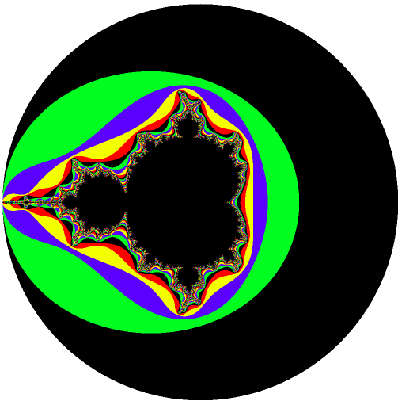
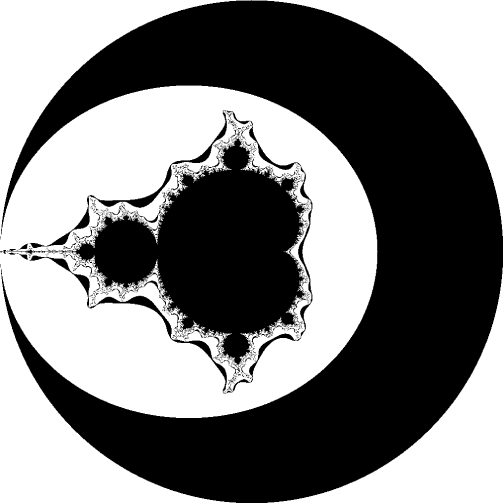

# The Mandelbrot Set
I love art and i want to write code. 
This is my first take on art using the code. The teeny tiny step.
Math has always fascinated me and after watching a video about the amazing madlebrotset i wanted to draw it.  
Those of you who does not know what it is, you can check the wikepedia page here -[Mandelbrot Set](https://en.wikipedia.org/wiki/Mandelbrot_set)

## Example

## How to run and experiment
Remember the nice old index.html ? Just that Open index.html to run in any browser. 
Try tweaking the values of **MAX_ITERATIONS** and **Colors** in main.js to generate different arts. 

## Todo
- [ ] Options for playing with colors and iteration in the page itself.
- [ ] Enabling Infinite zooming into picture, and generating very high reslution image instead of just 500 pixels.

## Contributions
Always welcome with open heart.
